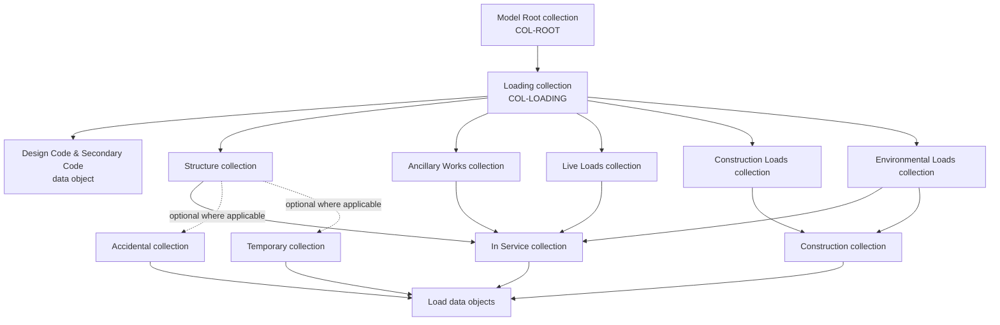
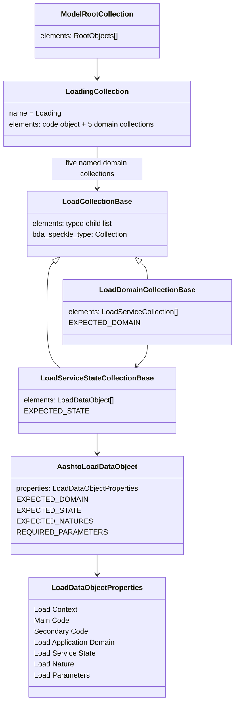
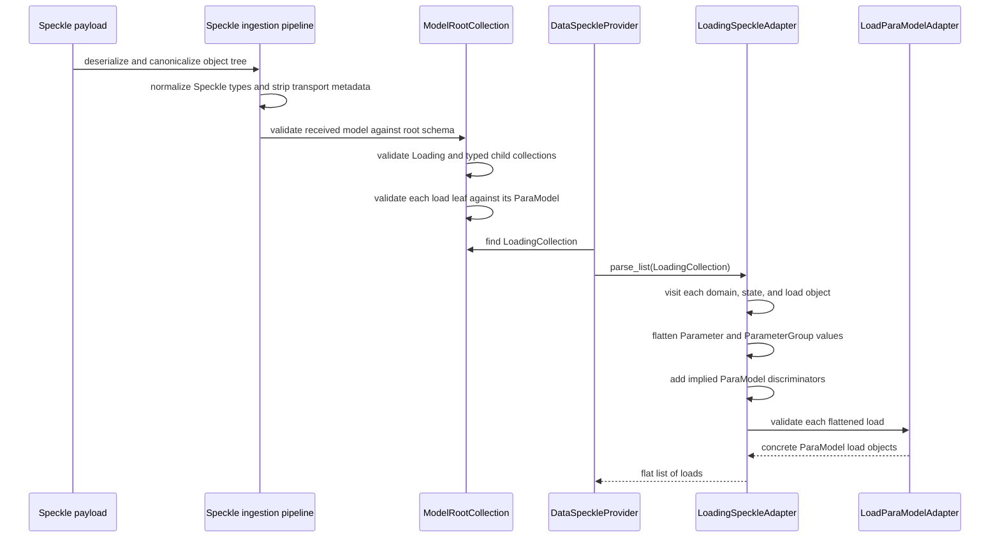

# Loading models: Speckle structure and implementation

## Purpose and scope

This document describes the current Speckle loading schema, how it is validated, and how it is converted into the existing ParaModel load types. It is intended as an implementation guide for developers extending the model.

The implementation uses two independent axes to organize loads:

- **Application domain:** Structure, Ancillary Works, Live Loads, Construction Loads, and Environmental Loads.
- **Service state:** In Service, Construction, Accidental, and Temporary.

The Python base classes and unions are shared schema abstractions. They do not introduce additional Speckle collection levels. The payload keeps domain collections above lifecycle collections, with load data objects at the leaves.

Current design-code support is AASHTO with either no secondary code or UAE. Existing AASHTO/UAE ParaModel classes provide load-specific validation. Traffic and settlement types are implemented in the current working tree alongside the shared loading schema; they have not yet been split into a separate branch or PR.

## Collection hierarchy

The model root may contain one `Loading` collection. `Loading` contains one code-configuration data object and exactly one of each standard domain collection. Each domain collection may contain whichever lifecycle collections are relevant to that model. Lifecycle collections hold load objects.



The lifecycle edges in the diagram show the reusable lifecycle types. The current implementation permits a domain collection to contain a subset of the lifecycle collections, including no lifecycle collections. Concrete load types and their validators determine which states currently have supported load objects. Accidental and Temporary are present as shared collection types, but no concrete load data object currently declares either state; those collections are therefore available as empty extension points.

### Current populated domain/state combinations

| Domain collection | Lifecycle collection | Current load data objects |
| --- | --- | --- |
| Structure | In Service | Structural dead load; prestressing load |
| Ancillary Works | In Service | Ancillary dead load |
| Live Loads | In Service | HL-93 vertical direct; HL-93 braking; pedestrian |
| Construction Loads | Construction | Execution load |
| Environmental Loads | In Service | Wind; uniform temperature; gradient temperature; earthquake; settlement |
| Environmental Loads | Construction | Wind during construction |
| Any domain | Accidental / Temporary | No concrete load objects yet |

The names above describe the current schema. A Speckle model may contain only the domains and lifecycle stages it needs, but the `Loading` collection itself has a stable set of five domain collections and one code-configuration data object.

## Shape of the tree in Python

The shared classes and unions are defined in [`loading_base.py`](../../src/bda/contracts/speckle_contracts/bda_analytical/loading/loading_base.py).



Concrete collection subclasses set a fixed `name` and expected domain/state. The `LoadingCollection` validates that its children contain the code configuration and each of the five standard domains exactly once. `ModelRootCollection` recognizes `LoadingCollection` as an optional root child and validates the root Speckle collection type using `SpeckleTypes.COLLECTION`.

## Speckle names and discriminators

The collection labels are the stable, human-readable hierarchy names:

- `Loading`
- `Structure`
- `Ancillary Works`
- `Live Loads`
- `Construction Loads`
- `Environmental Loads`
- `In Service`
- `Construction`
- `Accidental`
- `Temporary`

The code configuration is a **data object** named `Design Code & Secondary Code`, not an extra collection. This keeps the collection tree aligned with the domain/lifecycle hierarchy while still carrying the code metadata needed by ParaModel.

The schema uses different discriminators at different levels:

| Level | Discriminator | Purpose |
| --- | --- | --- |
| Root children | `name` | Selects model configuration, geometry, boundary conditions, deck layouts, or loading |
| Loading children | `name` | Selects the code configuration data object or one of the five domain collections |
| Domain children | `name` | Selects In Service, Construction, Accidental, or Temporary |
| Load data objects | `bda_speckle_type` | Selects the concrete BDA load type |

All collection contracts use Speckle’s standard collection type (`Speckle.Core.Models.Collections.Collection`). The load data object subtypes use the centralized `SpeckleTypes` members, with matching immutable `speckle_type` and `bda_speckle_type` literals. The latter is the discriminator for the load-object union and preserves the custom BDA type across Speckle serialization.

## Load object properties

Every load data object has common metadata in `LoadDataObjectProperties`:

| Speckle property | Meaning |
| --- | --- |
| `Load Context` | Currently must be `design` |
| `Main Code` | Currently must be `AASHTO` |
| `Secondary Code` | Currently `None` or `UAE` |
| `Load Application Domain` | Must agree with the domain collection and concrete load type |
| `Load Service State` | Must agree with the lifecycle collection and concrete load type |
| `Load Nature` | AASHTO load nature such as DC, LL, BR, EQ, or SE |
| `Load Parameters` | A parameter group holding load-specific input values |

Load-specific inputs are kept under `Load Parameters` so the common object shape stays consistent. Parameter groups can be nested, and individual parameters can include units. The concrete subtype declares a required-key set for this group; the existing ParaModel classes then validate detailed parameter structure, values, enums, and quantities.

`AashtoLoadDataObject` performs these checks when a leaf object is validated:

1. Context, code, domain, lifecycle state, and load nature match the subtype’s supported values.
2. All subtype-specific required keys are present in `Load Parameters`.
3. The object converts to a valid existing ParaModel through `LoadingSpeckleAdapter` and `LoadParaModelAdapter`.

Several ParaModel union discriminators are implied by the Speckle object’s own `bda_speckle_type`. The Speckle adapter inserts these when flattening the tree, rather than asking authors to enter the same variant choice a second time. For example, an `HL93BrakingLoadDataObject` supplies the ParaModel traffic tags for road, standard vehicle definition, HL-93, and braking.

## Load types currently represented

The concrete leaf classes are built in `loading_base.py` using `_load_object`. That helper centralizes the repeated Speckle data-object fields and binds each class to:

- Its `SpeckleTypes` value.
- Its display/data-object name.
- Expected domain, lifecycle state, and permitted load nature values.
- Required `Load Parameters` keys.

Current concrete types include:

| Speckle contract | Domain / state | Existing ParaModel type |
| --- | --- | --- |
| `StructuralDeadLoadDataObject` | Structure / In Service | `StructuralInServiceDeadLoad` |
| `PrestressingLoadDataObject` | Structure / In Service | `PrestressingInServiceLoad` |
| `AncillaryDeadLoadDataObject` | Ancillary Works / In Service | `NonStructuralInServiceDeadLoad` |
| `ExecutionLoadDataObject` | Construction Loads / Construction | `ExecutionLoad` |
| `WindInServiceLoadDataObject` | Environmental Loads / In Service | `WindInServiceLoad` |
| `WindInConstructionLoadDataObject` | Environmental Loads / Construction | `WindInConstructionLoad` |
| `UniformTemperatureLoadDataObject` | Environmental Loads / In Service | `UniformTemperatureLoad` |
| `GradientTemperatureLoadDataObject` | Environmental Loads / In Service | `GradientTemperatureLoad` |
| `EarthquakeLoadDataObject` | Environmental Loads / In Service | `EarthquakeLoad` |
| `HL93VerticalDirectLoadDataObject` | Live Loads / In Service | `HL93ModelVerticalDirectLoad` |
| `HL93BrakingLoadDataObject` | Live Loads / In Service | `HL93ModelBrakingLoad` |
| `PedestrianLoadDataObject` | Live Loads / In Service | `PedestrianStandardLoad` |
| `SettlementLoadDataObject` | Environmental Loads / In Service | `SettlementLoad` |

The existing ParaModel classes remain the source of detailed code-specific validation. The Speckle layer establishes the hierarchy and shared metadata, then delegates load-specific validation to ParaModel.

## How the conversion works

[`LoadingSpeckleAdapter`](../../src/bda/contracts/paramodel/loadings/speckle_adapter.py) converts a validated `LoadingCollection` into a flat list of existing load ParaModels.



During conversion:

1. `parse_list` walks every domain and lifecycle collection, skipping the code configuration data object.
2. Parameter groups are recursively flattened into dictionaries keyed by the ParaModel field names.
3. A parameter with a unit becomes a `{value, unit}` quantity shape. Unitless parameters become their raw values.
4. Variant tags that are determined by the Speckle subtype are inserted by the adapter.
5. Prestressing application dictionaries are converted into the list shape expected by `PrestressingInServiceLoad`.
6. `LoadParaModelAdapter.parse` validates and returns the concrete ParaModel type.

This keeps the provider independent of individual load fields. New load-specific validation should normally be added to the ParaModel class, while the Speckle adapter handles only shape conversion and values implied by the Speckle subtype.

## Provider behavior

`DataSpeckleProvider.get_loads_for_project()` in [`data_speckle_provider.py`](../../src/bda/infrastructure/data_providers/data_speckle_provider.py) logs the extraction start, searches the validated root for `LoadingCollection`, and returns the parsed ParaModel list. If the root has no loading collection, it logs that fact and returns an empty list. If a collection exists but contains invalid load data, Pydantic/ParaModel validation raises an error instead of silently dropping invalid loads.

This means a zero count can mean the model simply has no `Loading` collection. It does not, by itself, prove that a model with loading data was converted successfully.

## Tests and verification

[`test_speckle_loading_collections.py`](../../tests/unit/test_speckle_loading_collections.py) covers:

- A valid loading tree attached to the model root.
- Conversion of a structural dead load to `StructuralInServiceDeadLoad`.
- Provider extraction through `get_loads_for_project()`.
- Rejection when a load is placed under a domain collection that does not match its declared domain.
- Conversion of HL-93 vertical, braking, pedestrian, and settlement loads into their existing ParaModel classes.
- A domain collection containing only the lifecycle stage it currently needs.

The latest local unit run after the Speckle root collection type fix completed with **1,021 passed**:

```powershell
venv\Scripts\python.exe -m pytest tests/unit -q -p no:cacheprovider
```

The two credentialed MVP models previously used for smoke testing validated successfully but had no `Loading` collection. Their empty extraction results therefore verified ingestion and the provider’s missing-collection behavior, not live load conversion. A smoke test with a Speckle model that actually contains the new loading hierarchy remains necessary for end-to-end confirmation.

## Extending the schema

When adding a new load type:

1. Add a dedicated `SpeckleTypes.DATA_OBJECT_BDA_LOAD_...` enum member.
2. Add a mapping in `_LOAD_TYPE_BY_SUFFIX` and define the concrete subtype through `_load_object`, setting its expected domain, state, nature values, and required parameter keys.
3. Add the subtype to the `LoadDataObject` discriminated union.
4. If its ParaModel variant has discriminator fields implied by the BDA Speckle subtype, add them to `discriminator_defaults` in `LoadingSpeckleAdapter`.
5. Reuse or add the appropriate ParaModel class and update its existing discriminated union if needed.
6. Add tests for valid conversion, invalid values, and placement under the correct domain and lifecycle collections.
7. If the new type introduces a new lifecycle state, add its concrete load subtype and state checks; the shared lifecycle collection already exists.

To add another design-code family, keep the domain and lifecycle collection names unchanged. Add code-specific load subtypes/ParaModels and extend the code-configuration validation deliberately; current validation explicitly supports AASHTO and secondary code None/UAE only.

## Current limitations and follow-up

- No real Speckle model containing the new `Loading` tree has been used for an end-to-end load extraction check yet.
- Accidental and Temporary lifecycle collection classes exist, but no concrete load subtypes currently support those states.
- The current code configuration validation supports AASHTO with no secondary code or UAE; parallel design-code implementations are future work.
- Traffic and settlement are implemented in the current worktree but have not yet been split into their own branch/PR as originally planned.
